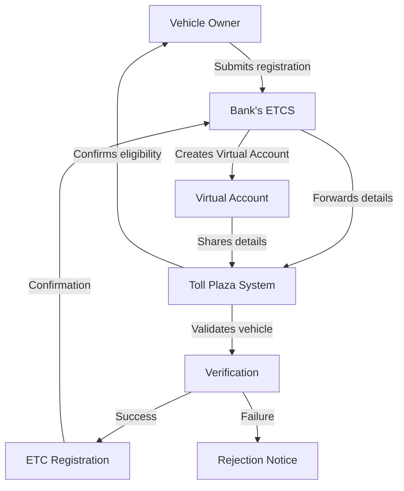
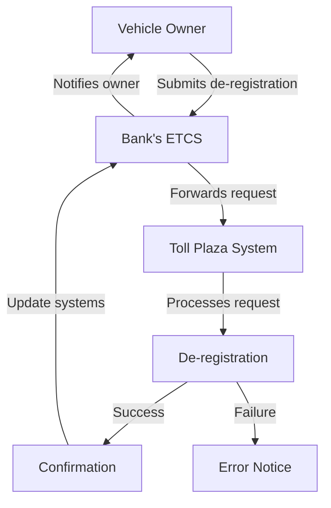
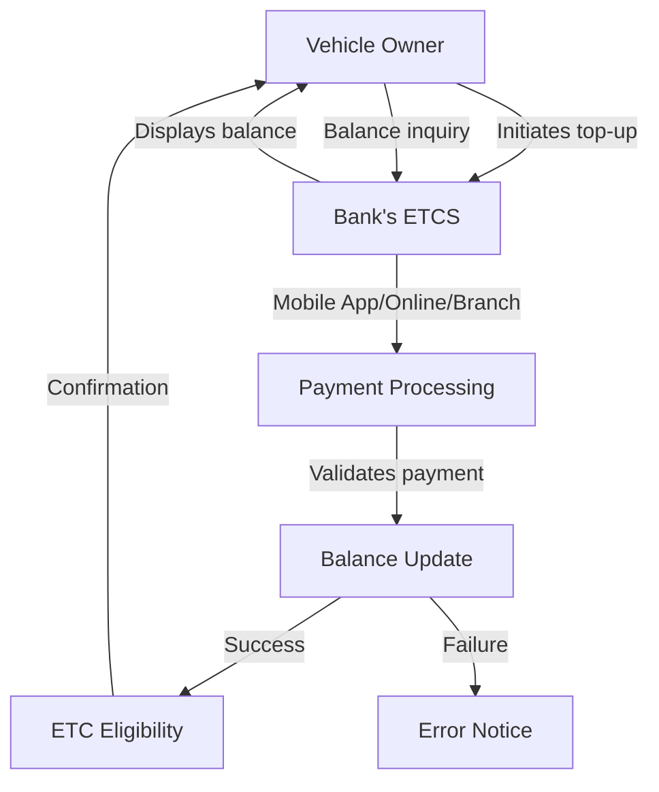
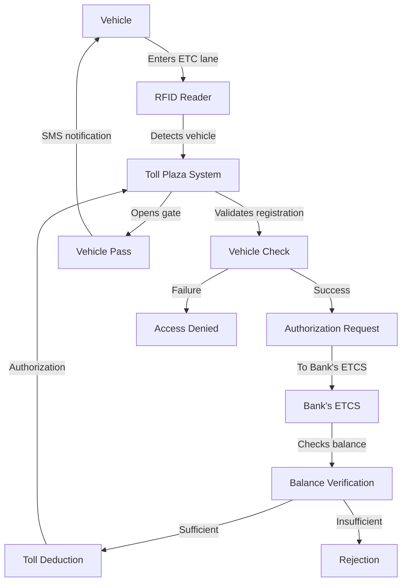
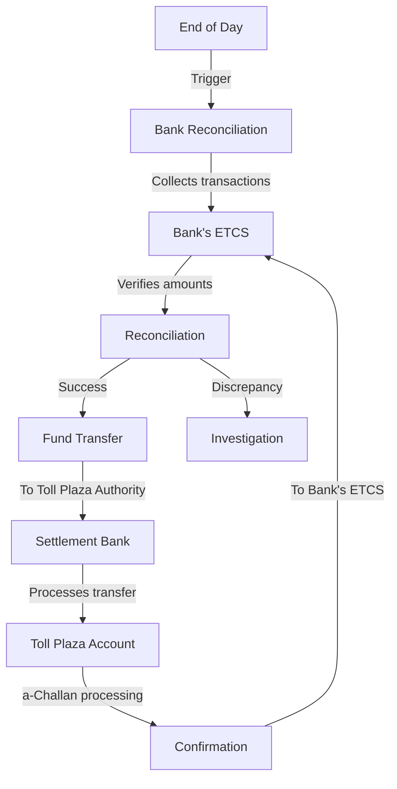

# Electronic Toll Collection System (ETCS) - Flow Diagrams

## 1. Vehicle Registration Flow Diagram

## 2. Vehicle De-Registration Flow Diagram

## 3. Vehicle Top-up Flow Diagram

## 4. Toll Plaza Pass Flow Diagram

## 5. Settlement Flow Diagram

## Diagram Key

- **Rectangles**: Processes/Steps
- **Diamonds**: Decision Points
- **Arrows**: Data/Control Flow
- **Color Coding**:
  - Blue: Bank's ETCS
  - Green: Toll Plaza System
  - Orange: Vehicle Owner Actions
  - Purple: Financial Transactions
  - Red: Error/Failure Paths

## Notes

1. All diagrams show real-time processing constraints (2-3 seconds for toll plaza pass)
2. Security measures (encryption, authentication) are implied in all API communications
3. Both success and failure paths are included where applicable
4. Timelines are indicated (T+1 for settlement)
5. System components are clearly labeled in each diagram
